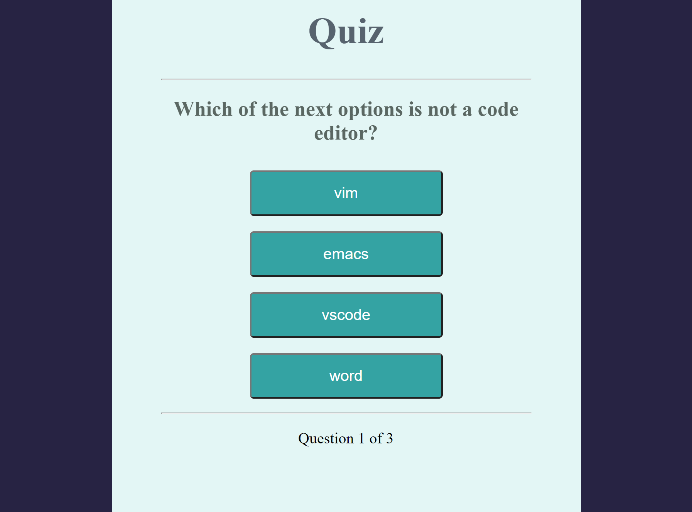

# OOP Javascript Project Quiz

## Construction
This project was builded as OOP practice in Javascript. In this case, the logic of the program is to make a Quiz with three questions and some options where the player is available to choose the option, look how many questions has the quiz and which one is answering at the moment and as final result the player is available to see how many answers he/her choosed correctly.

## Models and Methods
### Question:
### correctAnswer()
Return a boolean - correct if answer is correct or wrong if it is not.
### Quiz:
#### getQuestionIndex()
Return the question of the list.
#### isEnded()
Finish the quiz without release a error in console.
#### guess()
Combined with the methods getQuestionIndex() with correctAnswer increase total score and question index.
### UI:
#### showQuestions()
Create a new variable getting the element 'question' giving to the HTML the text
of the question.
#### showChoices()
Get the element 'choices' from HTML and create inside this tag the total of buttons required for the choices
#### showScores()
Create the tags required to send the final result and the score to the player
#### showProgress()
Get the element 'progress' and makes possible to see the current progress in the quiz
